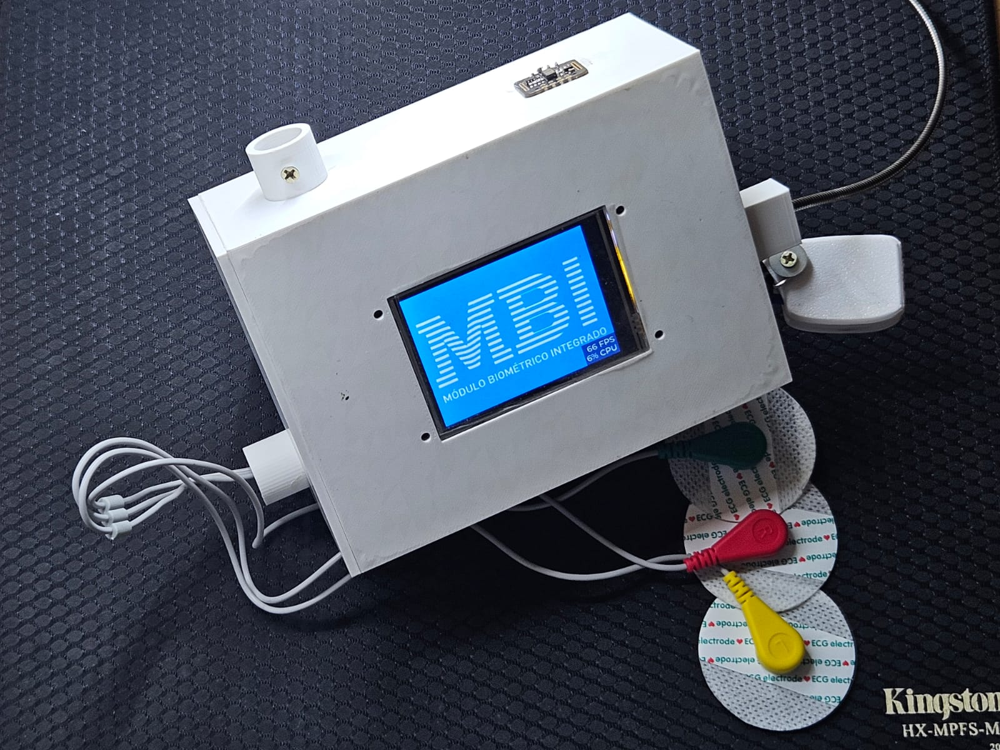
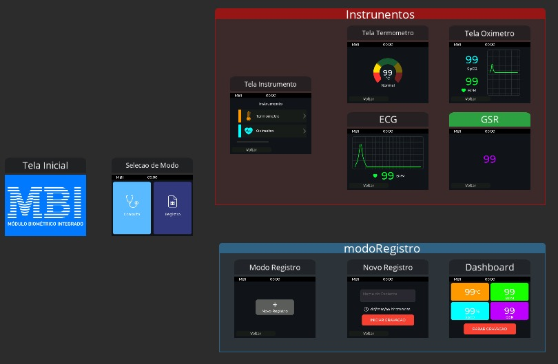

# MBI – Módulo Biométrico Integrado

> Plataforma embarcada portátil para **monitoramento integrado de sinais vitais**, baseada em **ESP32** com interface touchscreen desenvolvida em **LVGL**.


---

# Sobre o Projeto

O **MBI (Módulo Biométrico Integrado)** é uma plataforma embarcada de **baixo custo** desenvolvida para centralizar a medição e visualização de múltiplos **sinais vitais** em um único dispositivo portátil.

O projeto foi desenvolvido no curso de **Engenharia de Computação da UTFPR** como parte da disciplina **Oficinas de Integração I**, com o objetivo de explorar conceitos de:

- Sistemas embarcados
- Interfaces gráficas embarcadas
- Integração de sensores biomédicos
- Aquisição e registro de dados biométricos

Diferentemente de dispositivos tradicionais, que medem apenas um tipo de sinal vital, o MBI busca **unificar diferentes instrumentos biomédicos em uma única plataforma**, reduzindo custo e aumentando a acessibilidade do monitoramento fisiológico.

---

# Protótipo do Sistema

<p align="center">
  
</p>

---

# Arquitetura do Sistema

O sistema é dividido em três camadas principais.

## Hardware

O núcleo do sistema é a placa **ESP32-2432S028R**, que integra:

- Microcontrolador **ESP32-WROOM-32**
- Display **TFT 2.8” touchscreen**
- Slot para **cartão MicroSD**

Componentes adicionais:

- **RTC DS3231** – registro temporal das medições
- Sensores biométricos
- Interface de alimentação e comunicação

### Sensores Integrados

- **MAX30102** – frequência cardíaca e SpO₂
- **MLX90614** – temperatura corporal sem contato
- **AD8232** – aquisição de sinais ECG
- **Sensor GSR** – resposta galvânica da pele

---

## Firmware

O firmware foi desenvolvido em **C/C++ utilizando Arduino Framework** e é responsável por:

- Aquisição de dados dos sensores
- Processamento básico dos sinais biométricos
- Gerenciamento do sistema de armazenamento
- Comunicação com a interface gráfica

---

## Interface Gráfica

A interface foi desenvolvida utilizando:

- **LVGL (Light and Versatile Graphics Library)**
- **SquareLine Studio**

Principais funcionalidades da GUI:

- Navegação entre telas
- Visualização dos sinais biométricos
- Interface touchscreen interativa
- Integração com o firmware do dispositivo

<p align="center">
  
</p>

---

# Modos de Operação

O sistema possui dois modos principais.

## Modo Consulta

Permite visualizar **leituras instantâneas dos sensores** em tempo real.

Características:

- Medições pontuais
- Sem armazenamento permanente
- Ideal para verificações rápidas

---

## Modo Registro

Permite registrar medições para análise posterior.

Funcionalidades:

- Criação de **registro com identificador de usuário**
- Armazenamento automático em **cartão MicroSD**
- Arquivos no formato **CSV**
- Registro com **timestamp utilizando RTC**

Os dados podem ser exportados e analisados posteriormente em ferramentas como **Python (Pandas)** ou **Excel**.

---

# Tecnologias Utilizadas

## Linguagem

- C++

## Hardware

- ESP32
- Display TFT Touchscreen
- Sensores biométricos

## Bibliotecas

- LVGL
- TFT_eSPI
- RTClib
- SD.h
- MAX30102 Library
- Adafruit_MLX90614

---

# Estrutura do Repositório


```text
MBI_OFICINAS1
│
├── libs                    # Bibliotecas utilizadas no projeto
├── squareline_project      # Projeto da interface gráfica
│   └── UI                  # Telas e componentes gerados pelo SquareLine Studio
├── src                     # Código fonte principal do firmware
├── .gitignore              # Arquivos ignorados pelo Git
├── lv_conf.h               # Arquivo de configuração da biblioteca LVGL
└── MBI_Oficinas1.ino       # Arquivo principal do firmware (ESP32)
```

---

# Autores

Projeto desenvolvido por alunos de **Engenharia de Computação – UTFPR**.

- Marcos Vinícius Camera
- Leonardo Pereira Shibata
- Leonardo S. P. Bettio

